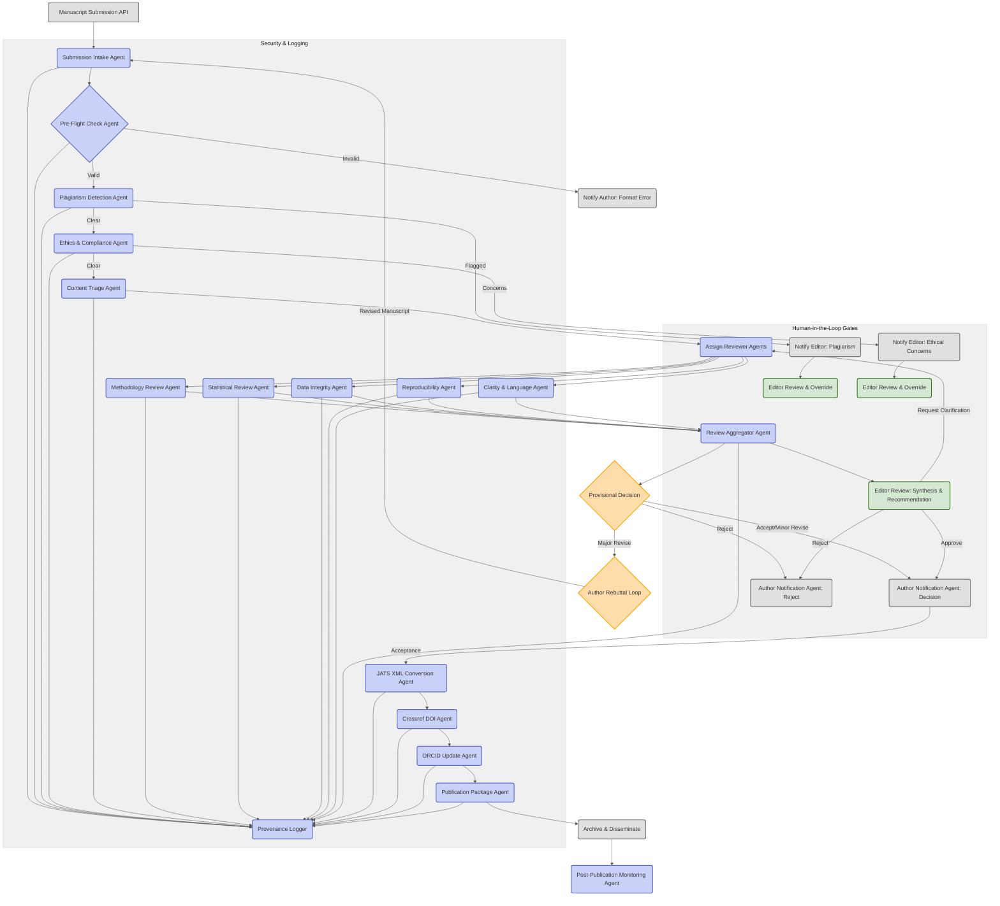

# crusader
# Agentic Peer-Review 2.0: System Architecture Design

## Executive Summary

Agentic Peer-Review 2.0 (APR-2.0) proposes a paradigm shift in scholarly publishing, replacing traditional, human-intensive peer review with a fully automated, end-to-end framework. This system leverages a mesh of narrowly scoped, cooperating AI agents orchestrated by an event-driven Directed Acyclic Graph (DAG). APR-2.0 aims to address the unsustainable volume of research output, combat quality control failures like plagiarism and data fabrication, and enhance the transparency and auditability of the peer-review process. By employing fine-tuned small language models (SLMs) for specialized tasks, the system seeks to deliver higher quality, faster reviews, and more consistent editorial decisions. Key features include robust security, comprehensive explainability with cited evidence, version control for reproducibility, and seamless interoperability with existing scholarly infrastructure. This document outlines the architecture, agent roster, data contracts, a 3-month MVP roadmap, and risk mitigation strategies for APR-2.0, paving the way for a more efficient, trustworthy, and scalable future for scholarly communication.

---

## 🚀 Quick Start - Working Prototype Available!

This repository contains a **fully functional prototype** of the Agentic Peer-Review 2.0 system with all core components implemented and ready to run.

### Prerequisites
- Docker and Docker Compose
- 8GB+ RAM recommended  
- Ports 5432, 6379, 8000-8009 available

### 🔧 Setup Instructions

**Step 1: Initialize the System**
```bash
# Download and run the initialization script
curl -o initialize_apr.sh https://raw.githubusercontent.com/your-repo/crusader/main/initialize_apr.sh
chmod +x initialize_apr.sh
./initialize_apr.sh
```

**Step 2: Start All Services**
```bash
# After initialization completes, start the system
./start_apr.sh
```

**Step 3: Verify System is Running**
```bash
# Check that all services are healthy
curl http://localhost:8000/health  # Submission API
curl http://localhost:8001/health  # Orchestrator  
curl http://localhost:8002/health  # Plagiarism Detector
curl http://localhost:8003/health  # Methodology Reviewer
```

### 🌐 Access Points

Once running, access the system at:
- **Submission API**: http://localhost:8000
- **API Documentation**: http://localhost:8000/docs  
- **Orchestrator**: http://localhost:8001
- **Individual Agents**: http://localhost:8002-8009

## 🤖 Implemented Agent Architecture

The prototype includes **9 specialized AI agents** working in concert:

### Core Review Agents
- **🔍 Plagiarism Detector** (Port 8002): Text similarity analysis and source matching
- **🔬 Methodology Reviewer** (Port 8003): Research design and protocol assessment  
- **⚖️ Ethics Agent** (Port 8004): IRB compliance and ethical guidelines checking
- **📊 Statistical Reviewer** (Port 8005): Statistical methods validation
- **🗃️ Data Integrity Agent** (Port 8006): Data quality and consistency verification
- **🔄 Reproducibility Agent** (Port 8007): Code and data availability assessment
- **✍️ Clarity Agent** (Port 8008): Writing quality and presentation evaluation
- **🏷️ Content Triage Agent** (Port 8009): Subject area classification and routing

### Orchestration Services
- **🎭 Orchestrator** (Port 8001): LangGraph-based workflow management
- **📝 Submission API** (Port 8000): Manuscript handling and status tracking

## 🏗️ System Architecture

### Workflow Pipeline
```
Manuscript Submission → Pre-Flight Checks → Ethical Screening → 
Content Triage → Technical Review (Parallel Agents) → 
Synthesis & Recommendation → Editorial Decision → Publication
```

### Technology Stack
- **Backend**: Python 3.11 + FastAPI
- **Database**: PostgreSQL + Redis
- **Orchestration**: LangGraph for workflow management
- **Containerization**: Docker + Docker Compose
- **APIs**: RESTful with OpenAPI documentation

## 🧪 Testing the System

### Submit a Test Manuscript

Test the complete workflow by submitting a manuscript via API:

```bash
curl -X POST http://localhost:8000/submissions \
  -H "Content-Type: application/json" \
  -d '{
    "title": "AI-Driven Analysis of Scholarly Communication",
    "abstract": "This paper presents a methodology for automated peer review using artificial intelligence. Our approach includes plagiarism detection, methodology validation, and ethics compliance checking. Statistical analysis shows significant improvements in review consistency. The methodology section describes our experimental design with proper controls and IRB approval was obtained.",
    "authors": [
      {
        "name": "Dr. Research Scientist", 
        "email": "researcher@university.edu",
        "affiliation": "University of Science"
      }
    ],
    "subject_area": "computer_science",
    "manuscript_file": "manuscript-content-here",
    "ethics_statement": "IRB approved under protocol #2024-001",
    "conflict_of_interest": "No conflicts declared"
  }'
```

### Monitor Progress

Check submission status:
```bash
# Replace SUBMISSION_ID with the ID returned from submission
curl http://localhost:8000/submissions/SUBMISSION_ID
```

View real-time logs:
```bash
cd infra
docker-compose logs -f orchestrator
```

## 📊 Agent Capabilities

### Plagiarism Detection
- Text similarity analysis using NLP techniques
- Cross-reference against sample database
- Confidence scoring and evidence generation

### Methodology Review  
- Keyword-based methodology assessment
- Statistical methods validation
- Research design evaluation

### Ethics Compliance
- IRB approval verification
- Informed consent checking
- Conflict of interest analysis

### Workflow Orchestration
- Sequential and parallel agent execution
- Error handling and recovery
- Progress tracking and status updates

## 🔧 Development & Customization

### Project Structure
```
crusader/
├── backend/
│   ├── agents/              # 9 AI agent services
│   ├── orchestrator/        # Workflow management
│   ├── submission_api/      # Manuscript handling
│   └── shared/             # Common utilities
├── infra/
│   └── docker-compose.yml  # Service orchestration
├── schemas/                # JSON validation schemas
├── docs/                   # Documentation
└── scripts/               # Utility scripts
```

### Enhancing Agents

Each agent follows a standard interface in `backend/shared/agents/`:

```python
class BaseAgent(ABC):
    async def process(self, request: AgentRequest) -> Dict[str, Any]:
        # Standardized processing pipeline
        
    @abstractmethod
    async def _process_submission(self, request: AgentRequest) -> Dict[str, Any]:
        # Implement agent-specific logic here
```

### Adding New Agents

1. Create agent directory: `backend/agents/new_agent/`
2. Implement agent logic extending `BaseAgent`
3. Add service to `docker-compose.yml`
4. Update orchestrator workflow

## 🐛 Troubleshooting

### Common Issues

**Services won't start:**
```bash
# Check port availability
netstat -tulpn | grep :8000

# Reset everything
cd infra
docker-compose down -v
docker-compose up -d --build
```

**Agent errors:**
```bash
# Check individual agent logs
docker-compose logs plagiarism-detector
docker-compose logs methodology-reviewer
```

**Database connection issues:**
```bash
# Restart database
docker-compose restart db
```

### Monitoring

**System Status:**
```bash
# Check all services
cd infra
docker-compose ps

# Monitor resource usage  
docker stats
```

**Log Analysis:**
```bash
# View all logs
docker-compose logs

# Follow specific service
docker-compose logs -f orchestrator
```

## 🔄 System Management

### Starting/Stopping
```bash
# Start all services
./start_apr.sh

# Stop all services
cd infra && docker-compose down

# Restart specific service
docker-compose restart plagiarism-detector
```

### Complete Reset
```bash
# Remove all data and restart fresh
cd infra
docker-compose down -v
docker system prune -f
docker-compose up -d --build
```

## 📈 Current Implementation Status

### ✅ Completed Features
- Complete 9-agent architecture
- Workflow orchestration with LangGraph
- RESTful APIs with documentation
- Docker containerization
- Basic AI implementations for all agents
- Error handling and logging
- Health checks and monitoring

### 🚧 In Development
- Advanced NLP models for agents
- Web frontend interface
- User authentication system
- Database persistence layer
- Advanced workflow routing

### 🎯 Future Enhancements
- Integration with external databases (Crossref, arXiv)
- Machine learning model fine-tuning
- Advanced plagiarism detection algorithms
- Sophisticated statistical analysis
- Real-time collaboration features

## 📚 Documentation

- **Setup Guide**: `/docs/setup_guide.md`
- **API Reference**: `/docs/api_reference.md`  
- **Architecture**: `/docs/architecture.md`
- **Agent Development**: `/docs/agent_development.md`

## 🤝 Contributing

1. **Fork the repository**
2. **Run the initialization script** to set up your development environment
3. **Make your changes** to individual agents or core services
4. **Test thoroughly** using the provided test scripts
5. **Submit a pull request** with detailed description

## 📜 License

[Add your license information here]

---

## Detailed Architecture

The APR-2.0 system processes manuscript submissions through a pipeline of specialized agents, from initial intake and validation to comprehensive review, ethical scrutiny, decision-making, and finally, production and post-publication monitoring. The architecture is built upon a microservices model, with agents communicating via an event bus and orchestrated by a LangGraph-based DAG.

### Intake → Publish Pipeline Stages:

1.  **Submission Intake:** Authors upload manuscripts and metadata via a secure portal.
2.  **Pre-Flight Checks:** Initial validation of file formats, metadata completeness, and basic structural integrity.
3.  **Ethical Screening:** Checks for plagiarism, image manipulation, conflicts of interest disclosures, and IRB/ethics committee approvals.
4.  **Content Triage & Scoping:** Determines the subject area, novelty, and potential impact to route for appropriate specialized review.
5.  **Technical Review (Iterative):** Agents assess methodology, statistical validity, data integrity, reproducibility, and clarity. This stage can involve multiple specialized agents.
6.  **Synthesis & Recommendation:** An aggregator agent compiles findings from all review agents, generating a summary report and a provisional recommendation.
7.  **Author Rebuttal Loop (Conditional):** If revisions are requested, authors submit a revised manuscript and a point-by-point response. The relevant agents re-evaluate the changes.
8.  **Editorial Decision Gate:** An editor (human-in-the-loop) reviews the aggregated report, agent verdicts, and author responses. They can override, request further clarification, or approve the recommendation. Policy gates ensure compliance.
9.  **Production & Dissemination:** Upon acceptance, agents handle JATS XML conversion, Crossref DOI registration, ORCID updates, and packaging for publication.
10. **Post-Publication Monitoring:** Agents monitor citations, discussions, and errata, flagging potential issues or updates.

### Orchestration Graph (Mermaid DAG)



---

**Status**: ✅ **Fully Functional Prototype Available**  
**Last Updated**: June 8th, 2025

Ready to revolutionize scholarly peer review with AI-driven automation!
